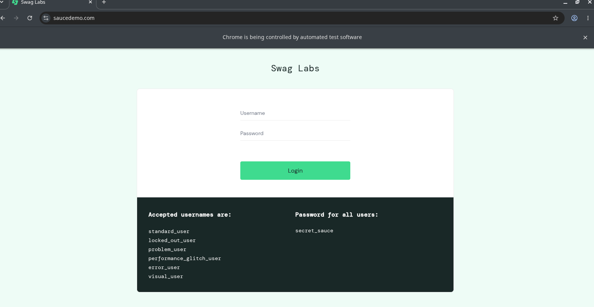
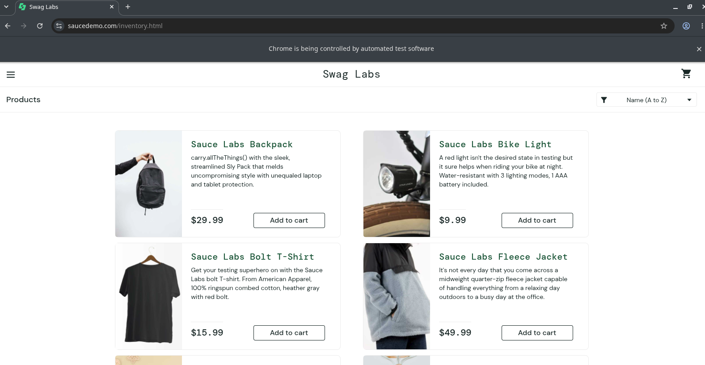
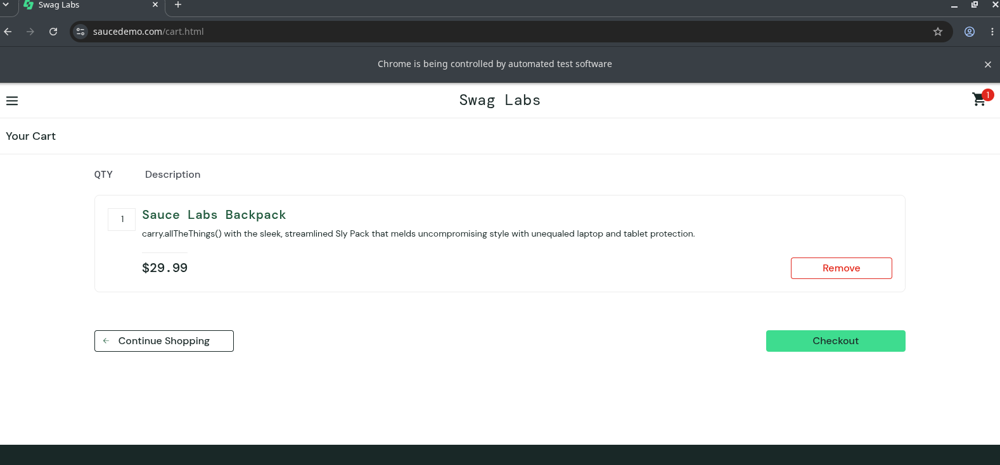
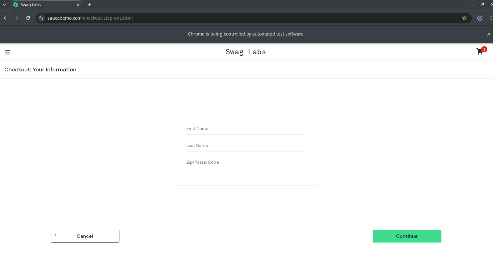
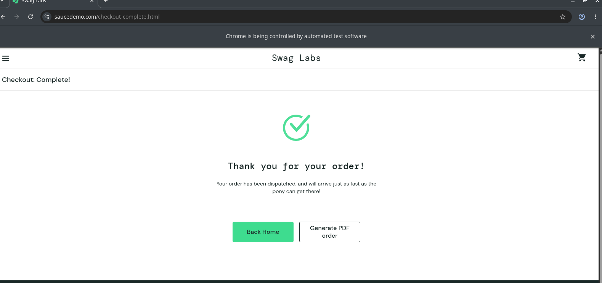

# Selenium Automation

A simple automation script made with Python and Selenium.

This project automates a basic shopping process on [SauceDemo](https://saucedemo.com), from login to completing the checkout.

## What it does

The script:

* Opens SauceDemo
* Logs in with a test account
* Selects the Sauce Labs Backpack
* Adds it to the cart
* Goes to checkout
* Fills in the checkout information
* Finishes the order

## Files

```text
.
├── login_selenium.py
└── functions.py
```

### login_selenium.py

Main file of the project. It defines the automation flow:

```python
openWindow("https://saucedemo.com")

login("standard_user", "secret_sauce")

addItemToCart("//div[text()='Sauce Labs Backpack']")

finish()
```

### functions.py

Contains the Selenium configuration and the functions used by the main script.

It also contains the decorators used to add extra actions to the automation.

## Decorators

I used decorators to keep some parts of the automation outside of the main functions.

For example:

```python
@login_successful
def login(user, password):
    ...
```

After `login()` runs, the decorator checks if the login was successful.

The same idea is used with `addItemToCart()`:

```python
@checkout
def addItemToCart(xpath_item):
    ...
```

After adding the item, the decorator takes the browser to the cart and starts the checkout process.

## Selenium

The script uses `WebDriverWait` and `Expected Conditions` instead of fixed delays.

Example:

```python
wait.until(
    EC.element_to_be_clickable((By.ID, "login-button"))
).click()
```

This was also a way for me to practice working with elements that may not be immediately available on the page.

## Automation
Website is opened


Login Successful


Item added to cart


Checkout


Payment Succesful


## Requirements

* Python 3
* Google Chrome
* Selenium

Install Selenium:

```bash
pip install selenium
```

## Usage

Run the main script:

```bash
python3 login_selenium.py
```

The browser will open and perform the automation automatically.

## Test Account

SauceDemo provides this account for testing:

```text
Username: standard_user
Password: secret_sauce
```

## Notes

This is a small personal project made to practice Selenium and Python.

The script is specifically built around SauceDemo, so the selectors and functions are not meant to work with other websites without modifications.

## Author

d4vidlinux
